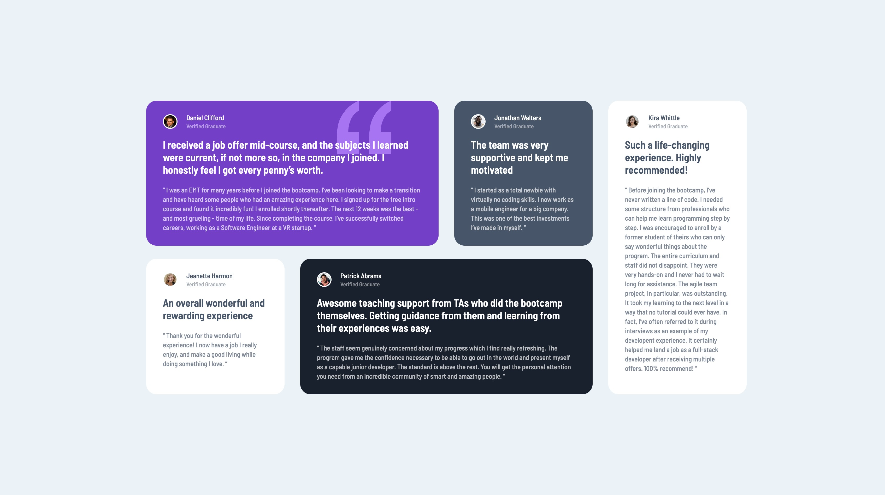
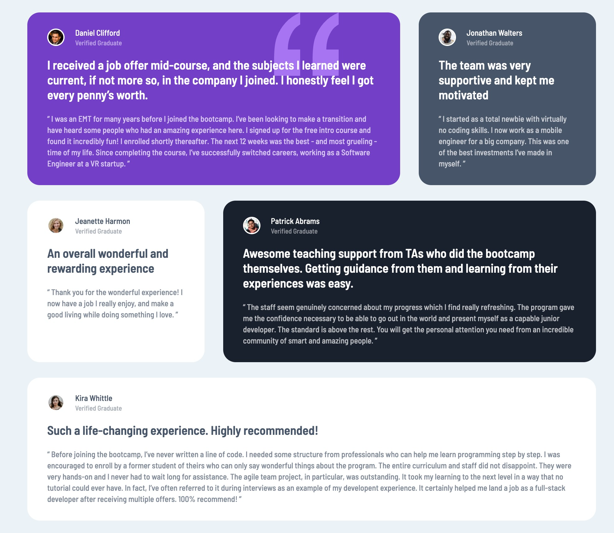

# Frontend Mentor - Testimonials grid section solution

This is a solution to the [Testimonials grid section challenge on Frontend Mentor](https://www.frontendmentor.io/challenges/testimonials-grid-section-Nnw6J7Un7). Frontend Mentor challenges help you improve your coding skills by building realistic projects.

## Overview

### The challenge

Users should be able to:

- View the optimal layout for the site depending on their device's screen size

### Links

- Solution URL: [https://github.com/metinahmeterkeles/Testimonials-Grid-Section](https://github.com/metinahmeterkeles/Testimonials-Grid-Section)
- Live Site URL: [https://testimonials-grid-section-livid.vercel.app/](https://testimonials-grid-section-livid.vercel.app/)

## My process

### Built with

- Semantic HTML5 markup
- CSS custom properties
- CSS Grid

### What I learned

```css
.card1 {
  background-image: url('/images/bg-pattern-quotation.svg');
  background-repeat: no-repeat;
  background-position: 80% 0;
  background-color: #733fc8;
}

.container {
  grid-template-columns: repeat(auto-fill, minmax(50%, 1fr));
  grid-template-rows: minmax(auto, auto);
}

.card {
  grid-column: unset;
  grid-row: unset;
}
```

### Useful resources

- [https://css-tricks.com/snippets/css/complete-guide-grid/](https://css-tricks.com/snippets/css/complete-guide-grid/)
- [https://courses.kevinpowell.co/view/courses/conquering-responsive-layouts/](https://courses.kevinpowell.co/view/courses/conquering-responsive-layouts/) - This is an amazing article which helped me finally understand responsive layouts. I'd recommend it to anyone still learning this concept.

## Author

- Website - [https://github.com/metinahmeterkeles](https://github.com/metinahmeterkeles)
- Frontend Mentor - [@metinahmeterkeles](https://www.frontendmentor.io/profile/metinahmeterkeles)

### Desktop Screenshot



### Tablet Screenshot



### Mobile Screenshot


